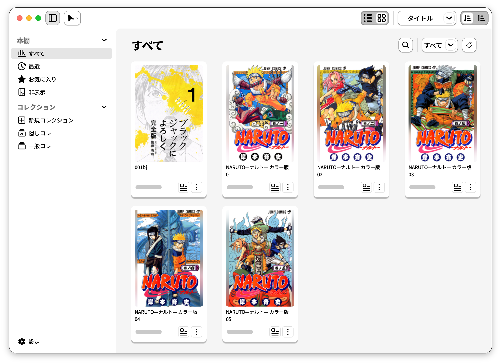
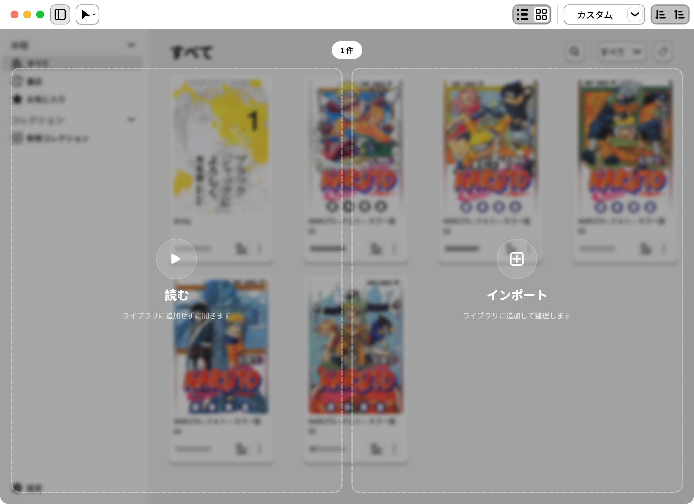
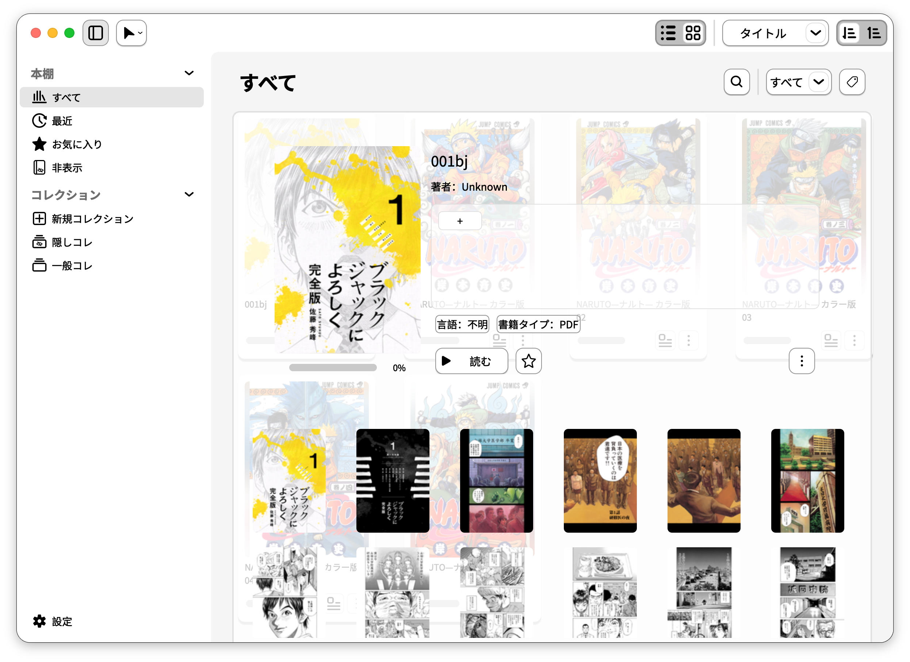
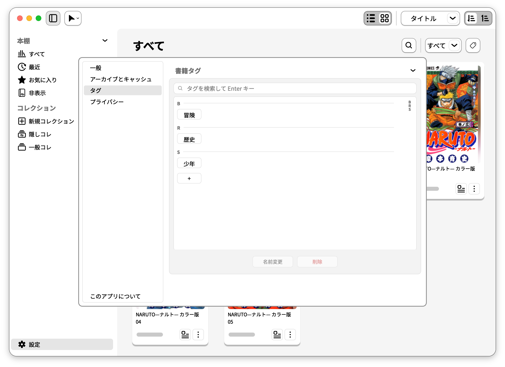

<a href="README.md">English</a> · <a href="README.zh-CN.md">简体中文</a> · <strong>日本語</strong>

<h1 align="center">ジョイヨミ · JoyRead</h1>

  
  
  
  
  

<strong>ローカルの蔵書管理をもっと手軽に。読みたいときに、すぐ読める。</strong>

<a href="https://github.com/CtfTnk/JoyRead/releases/latest">ダウンロード</a> · <a href="docs/MANUAL.md">使い方（英語）</a> · <a href="https://github.com/CtfTnk/JoyRead/releases/tag/v1.1.0">1.1.0 の更新内容</a> · <a href="https://github.com/CtfTnk/JoyRead/issues">不具合の報告</a>

JoyRead は **macOS、Windows、Ubuntu/Linux** 向けのローカル漫画・PDF リーダー兼ライブラリ管理アプリです。お気に入りの本をインポートして整理することも、ファイルをそのまま開いて読み始めることもできます。アカウントやクラウドサービスは必要ありません。

## ダウンロードとインストール

| OS | 1.1.0 パッケージ | インストール方法 |
| --- | --- | --- |
| macOS 13+ · Apple Silicon | [DMG](https://github.com/CtfTnk/JoyRead/releases/download/v1.1.0/JoyRead-1.1.0-macos-arm64.dmg) | ディスクイメージを開き、JoyRead を Applications にドラッグします。 |
| Windows · x64 | [EXE](https://github.com/CtfTnk/JoyRead/releases/download/v1.1.0/JoyRead-1.1.0-windows-x86_64-setup.exe) | インストーラーの案内に従います。 |
| Ubuntu 22.04+ / Linux · amd64 | [DEB](https://github.com/CtfTnk/JoyRead/releases/download/v1.1.0/JoyRead-1.1.0-linux-amd64.deb) | ターミナルで `sudo apt install ./JoyRead-1.1.0-linux-amd64.deb` を使います。 |
| Ubuntu 22.04+ / Linux · arm64 | [DEB](https://github.com/CtfTnk/JoyRead/releases/download/v1.1.0/JoyRead-1.1.0-linux-arm64.deb) | ターミナルで `sudo apt install ./JoyRead-1.1.0-linux-arm64.deb` を使います。 |

**Ubuntu ではターミナルからインストールしてください。** GUI インストーラーは **「Preparing」** で停止するため使用できません。この問題は未修正です。ダウンロード先のフォルダーでターミナルを開き、上の表にあるパッケージに対応するコマンドを実行してください。

パッケージとチェックサムは[リリースページ](https://github.com/CtfTnk/JoyRead/releases/tag/v1.1.0)にあります。macOS 版は Apple の公証を受けておらず、Windows 版にも信頼されたコード署名はありません。初回起動時の案内と実機検証状況はリリースノートをご確認ください。Intel Mac 用のパッケージはありません。

## 読むことも、整理することも

- **漫画アーカイブと PDF：** ZIP / CBZ、7z / CB7、RAR / CBR、PDF に対応。EPUB・ライトノベル機能は未有効化です。
- **カード / リスト切り替え：** 表紙で探す表示とコンパクトな一覧を選択。検索、並べ替え、形式・タグでの絞り込みにも対応します。
- **タグとコレクション：** ジャンル、シリーズ、読書予定などで整理。お気に入り、最近読んだ本、読書進捗も管理できます。
- **非表示スペース：** 通常の本棚に表示したくない本やコレクションを隠し、アプリ内のパスワード画面からアクセスできます。
- **すぐに読める：** ファイルのドラッグ＆ドロップや OS の「このアプリケーションで開く」に対応。先にインポートする必要はありません。ファイル関連付けはインストール方法とデスクトップ環境に依存します。
- **読みやすい表示：** 単ページ・見開き、右から左・縦方向の読み進め、ズーム、表示サイズ調整、しおり、サムネイル、読書進捗。
- **3 言語の UI：** 英語、簡体字中国語、日本語。新規設定ではシステムに従い、未対応言語では英語を使用します。

## 使い方：ドロップして、読むか整理するかを選ぶ

対応ファイルをライブラリにドラッグし、左の **読む** にドロップすると直接開き、右の **インポート** にドロップするとライブラリへ追加します。左上の操作メニューから、ファイルを開く、開いてインポートする、ファイルやフォルダーをまとめて取り込むこともできます。

**直接開く**場合、初期設定ではファイルをコピーせず、本棚にも追加しません。**インポート**では元ファイルを残して管理用コピーを作成します。「開くときにインポート」を有効にすると、開いたファイルの取り込みも試みます。ただし、暗号化された漫画はインポートできません。

## 使い方：本の情報を整える

本の詳細ボタン、またはその他の操作メニューから詳細画面を開きます。

| 操作 | 内容 |
| --- | --- |
| タイトルや著者をダブルクリック | 手動編集し、Enter で保存。Esc またはフォーカス移動で取り消し。 |
| 言語をダブルクリック | 本の言語を選択。 |
| 表紙をダブルクリック | 表紙エディターで調整。元の書籍ファイルは変更しません。 |
| タグ欄の追加ボタン | 絞り込みに使うタグを付与。 |

漫画アーカイブに対応する **`meta.json` または `ComicInfo.xml`** が含まれている場合、JoyRead は読み取れたタイトル、著者、タグ、言語をインポート時に取り込みます。取得できる内容はメタデータの記載に依存します。情報がない場合や解析できない場合はファイル名や既定値を使い、詳細画面から修正できます。

## 使い方：タグで蔵書を整理する

詳細画面でタグを付け、ライブラリのツールバーで絞り込みます。**設定 → タグ** ではタグの検索、作成、名前変更、削除をまとめて管理できます。タグを削除しても本は削除されません。別のまとまりが必要なら、通常のコレクションや非表示のコレクションも使えます。

## 使い方：すぐに読み始める

リーダーでは単ページと見開き表示を切り替え、読む方向、しおり、ページサムネイル、進捗バーを使えます。本棚から続きを読むことも、ローカルファイルを開くアプリとして JoyRead を選ぶこともできます。

## 暗号化アーカイブと非表示機能について

- **暗号化された漫画は読めますが、インポートできません。** 対応するパスワード付き ZIP/CBZ、7z/CB7、RAR/CBR を開く際にパスワードを求めます。パスワードはそのセッションだけで使います。
- **非表示は GUI 上の機能であり、ファイルの暗号化ではありません。** 本やコレクションを隠しても、ディスク上のファイルは暗号化されません。
- 復号したページキャッシュは平文で保存されます。**設定 → プライバシー → 閉じるときにページキャッシュを削除**は初期設定で有効です。一部の形式では 7-Zip 補助プログラムのコマンドラインにパスワードが一時的に現れ、同じユーザーのプロセスから見える場合があります。AES ZIP はアプリ内で復号します。[詳しい説明](docs/MANUAL.md#encrypted-archives)をご覧ください。

## オープンソースと開発

JoyRead は **[GNU GPL v3.0 only](LICENSE)** で公開しています。第三者コンポーネントのライセンスは [THIRD_PARTY_NOTICES.txt](packaging/THIRD_PARTY_NOTICES.txt) を参照してください。スクリーンショット内の表紙・本文の権利は各権利者に帰属し、書籍はアプリに含まれず、JoyRead のソフトウェアライセンスの対象にもなりません。

ソースからの起動は英語版の [Development](README.md#development)、操作の詳細は[マニュアル](docs/MANUAL.md)、ビルド手順は[パッケージガイド](docs/PACKAGING.md)を参照してください。
