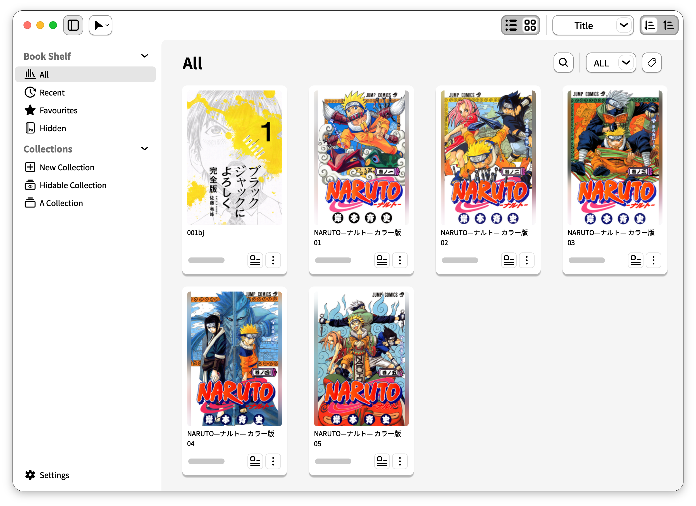
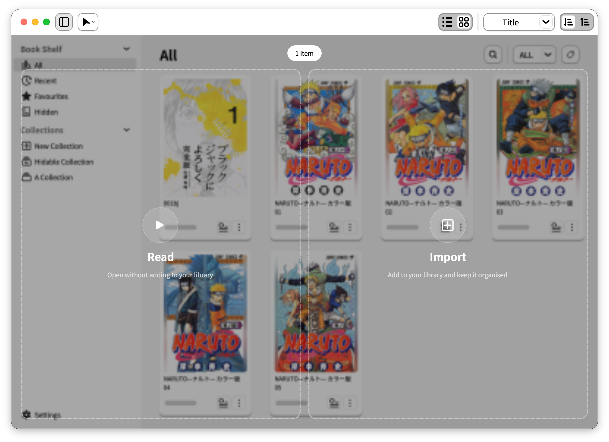
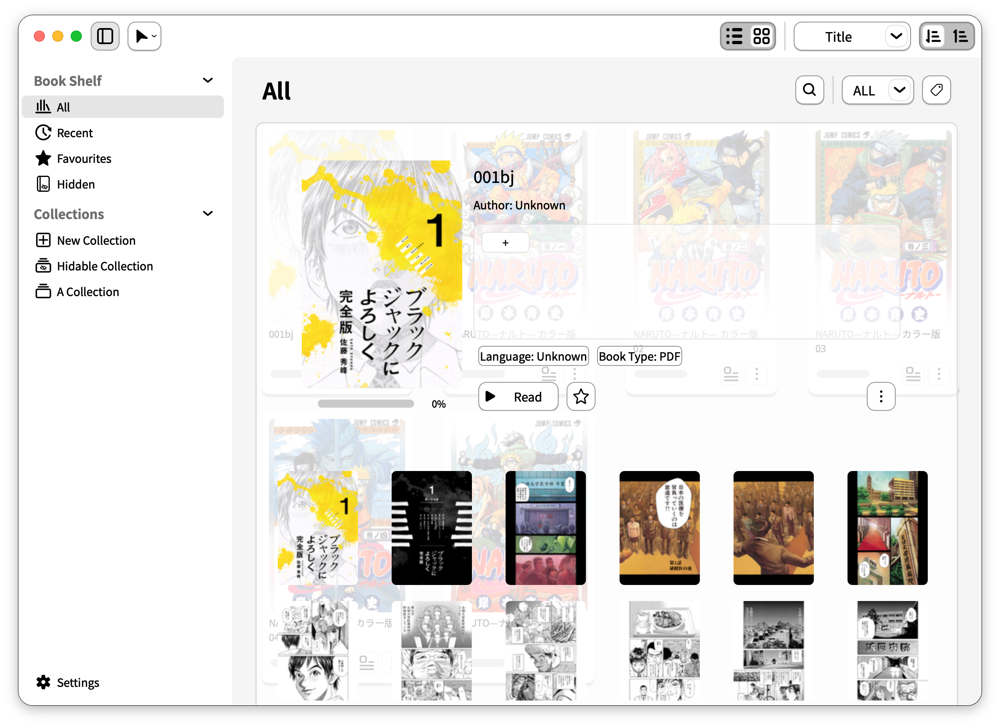
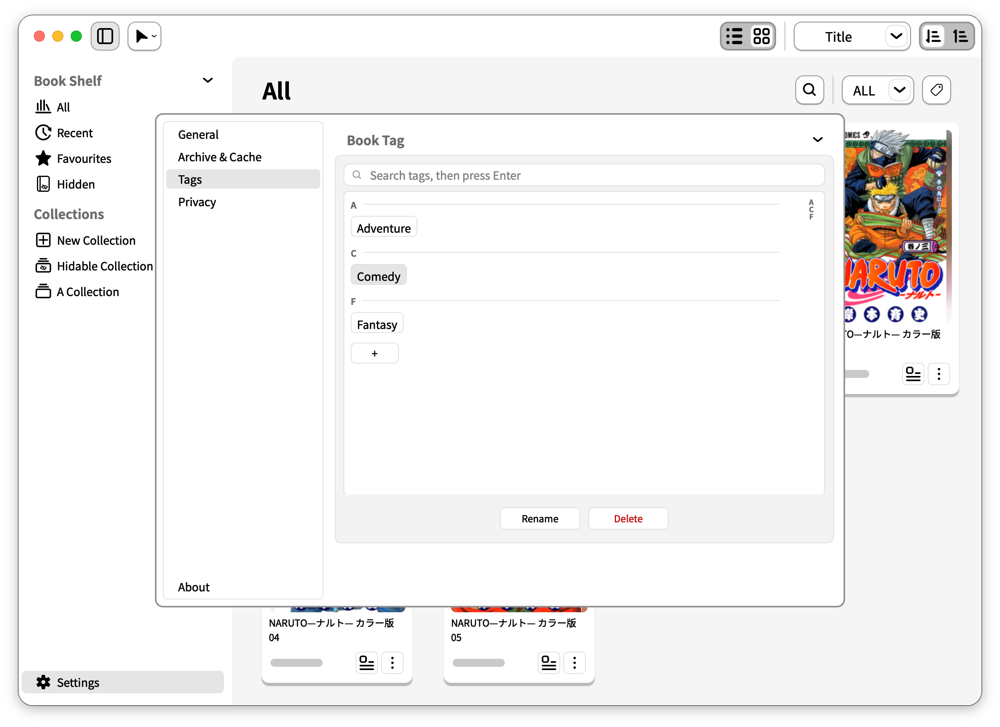

<p align="center"><strong>English</strong> · <a href="README.zh-CN.md">简体中文</a> · <a href="README.ja.md">日本語</a></p>

<p align="center">
  
</p>
<h1 align="center">JoyRead</h1>
<p align="center"><strong>Your local library, easier to manage. Your next book, ready to read.</strong></p>

<p align="center">
  <a href="LICENSE"></a>
  <a href="https://github.com/CtfTnk/JoyRead/releases/tag/v1.2.0"></a>
  <a href="#download"></a>
  <a href="#download"></a>
  <a href="#download"></a>
</p>
<p align="center">
  <a href="#download"><strong>Download</strong></a> ·
  <a href="#getting-started">Get started</a> ·
  <a href="#a-closer-look">Screenshots</a> ·
  <a href="docs/MANUAL.md">User manual</a> ·
  <a href="https://github.com/CtfTnk/JoyRead/releases/tag/v1.2.0">What's new</a> ·
  <a href="https://github.com/CtfTnk/JoyRead/issues">Feedback</a>
</p>

JoyRead is a local manga, comic, and PDF reader with a desktop library for **macOS, Windows, and Ubuntu/Linux**. Import your favourites for a collection you can keep organised, or open a file and start reading immediately. No account or cloud service required.



## Download

| Platform | JoyRead 1.2.0 | Installation |
| --- | --- | --- |
| macOS 13+ · Apple Silicon | [Download DMG](https://github.com/CtfTnk/JoyRead/releases/download/v1.2.0/JoyRead-1.2.0-macos-arm64.dmg) | Open the disk image and drag JoyRead into Applications. |
| Windows · x64 | [Download EXE](https://github.com/CtfTnk/JoyRead/releases/download/v1.2.0/JoyRead-1.2.0-windows-x86_64-setup.exe) | Run the installer and follow the setup prompts. |
| Ubuntu 22.04+ / Linux · amd64 | [Download DEB](https://github.com/CtfTnk/JoyRead/releases/download/v1.2.0/JoyRead-1.2.0-linux-amd64.deb) | Run `sudo apt install ./JoyRead-1.2.0-linux-amd64.deb`. |
| Ubuntu 22.04+ / Linux · arm64 | [Download DEB](https://github.com/CtfTnk/JoyRead/releases/download/v1.2.0/JoyRead-1.2.0-linux-arm64.deb) | Run `sudo apt install ./JoyRead-1.2.0-linux-arm64.deb`. |

**Ubuntu: install from the terminal only.** The graphical installer gets stuck at **“Preparing”**; this issue has not been fixed. Open a terminal in the download folder and run the command for your package above.

Find all packages and checksums on the [release page](https://github.com/CtfTnk/JoyRead/releases/tag/v1.2.0), or browse [previous releases](https://github.com/CtfTnk/JoyRead/releases). There is no Intel Mac package. macOS builds are not Apple-notarized, and Windows installers do not carry a trusted code signature; see the release notes for first-launch guidance and completed validation.

## Made for your local books

| Capability | What you can do |
| --- | --- |
| **Manga and PDF** | Read ZIP / CBZ, 7z / CB7, RAR / CBR, and PDF. EPUB / light novel reading is not enabled. |
| **Cards or lists** | Browse by cover or switch to a compact list. Search, sort, and filter by format or tag. |
| **Tags and collections** | Organise by genre, series, or reading plans, with favourites, recent books, and progress. |
| **Editable book details** | Correct titles, authors, and languages, adjust covers, and reuse embedded archive metadata. |
| **Hidden Space** | Keep books and collections out of the ordinary shelf behind an in-app password entry. This is GUI hiding, not encryption. |
| **Open and read** | Drag in a file or choose JoyRead through your operating system's **Open With** menu. Importing first is optional. |
| **A flexible reader** | Single pages or spreads, right-to-left and vertical reading, fit and zoom controls, bookmarks, thumbnails, and saved progress. |
| **Three interface languages** | English, Simplified Chinese, and Japanese. New profiles follow the system language, with English fallback. |

## Getting started

1. **Install and launch JoyRead.** A normal launch opens your library.
2. **Drop a supported file onto the window.** Choose **Read** on the left to open it, or **Import** on the right to keep it in your library. The action menu also offers Open, Open & Import, and file/folder import.
3. **Make the shelf yours.** Switch between cards and lists, create collections, add tags, and mark favourites.
4. **Start reading.** Open a book from the shelf, or use **Open With → JoyRead** in your file manager. File associations depend on installation and desktop integration.

**Read** opens one file in place without adding it to the library. **Import** makes a managed copy while preserving the original. The Settings option **Import when dropped on Library Read** makes that specific Read-zone drop also import; Open Book and the operating system's Open With remain read-only. **Open & Import** explicitly reads while importing in the background. Encrypted comics can be read with a password but cannot be imported.

## A closer look

### Drop a book. Read now or keep it.

A file you only want to glance through does not need a permanent place on your shelf. The drop overlay makes the choice explicit, while file and folder import lets you build a lasting library.



### Book details you can make your own

Open **Detail** from a book's detail button or More menu.

| Gesture | Action |
| --- | --- |
| Double-click the **title** or **author** | Edit the text and press Enter to save. Escape or moving focus away cancels. |
| Double-click the **language** | Select the book's language. |
| Double-click the **cover** | Open the cover editor and adjust the cover without changing the source book. |
| Use the **add tag** button | Attach tags for browsing and filtering. |

When an imported comic archive includes supported **`meta.json` or `ComicInfo.xml` metadata**, JoyRead preprocesses the available title, author, tags, and language for the library. Fields depend on what the archive actually supplies. Missing or unreadable metadata falls back to the filename or defaults, and you can correct the result in the detail view.



### Give your library a useful vocabulary

Add tags in book details, then filter by them from the shelf toolbar. **Settings → Tags** brings search, creation, renaming, and deletion together. Deleting a tag does not delete its books. Collections provide another way to group a series or reading list, including collections you want to hide.



### Settle into the page

Choose single-page or spread layouts, set your reading direction, and move through a book using thumbnails, bookmarks, or the progress bar. Resume from the library or use JoyRead as an immediate reader for a local file.

Hover over the progress bar to preview a page before jumping to it.


## Encrypted comics and Hidden Space

- **Encrypted comics can be read, but cannot be imported.** Supported password-protected ZIP/CBZ, 7z/CB7, and RAR/CBR archives request a password when opened. Passwords are used for the current session only.
- **Hidden Space is GUI hiding only.** Hidden books, hidden collections, and the in-app password do not encrypt files on disk.
- Decrypted page caches are stored **unencrypted**. **Settings → Privacy → Delete cached pages when closing** is enabled by default. Some archive formats pass the password to the 7-Zip helper's command line, briefly exposing it to same-user processes; AES ZIP is decrypted in-process. Read the [encrypted archive notes](docs/MANUAL.md#encrypted-archives) for details.

## Development

JoyRead is built with Python, PySide6, and SQLite. Use the repository's conda environment by path:

```bash
git clone https://github.com/CtfTnk/JoyRead.git
cd JoyRead
# Create once; skip this command if the environment already exists.
conda env create --prefix .conda/joyread-py312 -f environment-release.yml
conda activate ./.conda/joyread-py312
python -m joyread.app.main
```

Run tests with `python -m pytest -q`. To use a disposable library during development, set `JOYREAD_RUNTIME_DIR=/tmp/joyread-smoke` before launching. Dependencies live in `pyproject.toml`; refresh them with `python -m pip install -e '.[dev,release]'`.

The novel reader remains disabled and separate from the shipping app. Its optional `epub` extra adds dependencies for novel-reader development; installing it does not enable EPUB access.

[User manual](docs/MANUAL.md) · [Packaging](docs/PACKAGING.md) · [Changelog](CHANGELOG.md) · [Report an issue](https://github.com/CtfTnk/JoyRead/issues)

## License

JoyRead is free and open-source software under **[GNU GPL v3.0 only](LICENSE)**. See [THIRD_PARTY_NOTICES.txt](packaging/THIRD_PARTY_NOTICES.txt) for bundled component licenses.

Book covers and pages in the supplied screenshots belong to their respective rights holders. These books are not bundled with JoyRead and are not licensed under JoyRead's software license.
