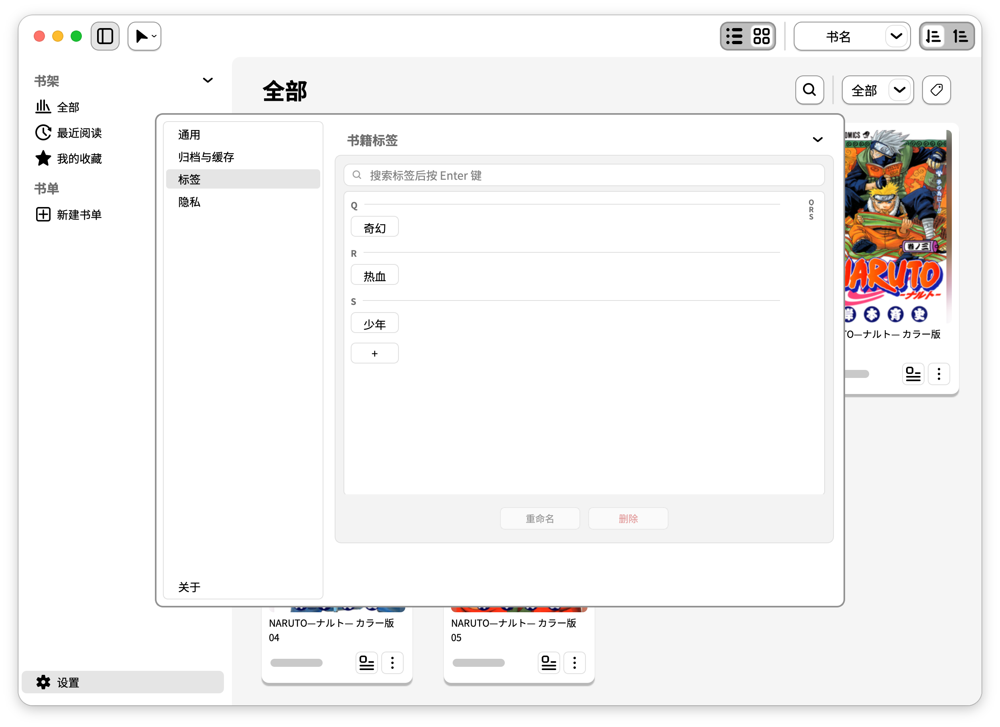

<a href="README.md">English</a> · <strong>简体中文</strong> · <a href="README.ja.md">日本語</a>

<h1 align="center">欣阅 · JoyRead</h1>

  
  
  
  
  

<strong>让本地书籍管理更加便捷，也是随时打开、即时阅读的选择。</strong>

<a href="https://github.com/CtfTnk/JoyRead/releases/latest">下载</a> · <a href="docs/MANUAL.md">使用手册（英文）</a> · <a href="https://github.com/CtfTnk/JoyRead/releases/tag/v1.0.2">1.0.2 更新</a> · <a href="https://github.com/CtfTnk/JoyRead/issues">问题反馈</a>

欣阅是一款面向 **macOS、Windows 和 Ubuntu/Linux** 的本地漫画与 PDF 阅读器，也是一座属于你的桌面书库。把喜爱的书籍导入后慢慢整理，或者直接打开文件开始阅读，无需账户或云端服务。

## 下载与安装

| 系统 | 1.0.2 安装包 | 安装方式 |
| --- | --- | --- |
| macOS 13+ · Apple Silicon | [DMG](https://github.com/CtfTnk/JoyRead/releases/download/v1.0.2/JoyRead-1.0.2-macos-arm64.dmg) | 打开磁盘映像，将 JoyRead 拖入 Applications。 |
| Windows · x64 | [EXE](https://github.com/CtfTnk/JoyRead/releases/download/v1.0.2/JoyRead-1.0.2-windows-x86_64-setup.exe) | 运行安装程序，按提示安装。 |
| Ubuntu/Linux · amd64 | [DEB](https://github.com/CtfTnk/JoyRead/releases/download/v1.0.2/JoyRead-1.0.2-linux-amd64.deb) | 在终端运行 `sudo apt install ./JoyRead-1.0.2-linux-amd64.deb`。 |
| Ubuntu/Linux · arm64 | [DEB](https://github.com/CtfTnk/JoyRead/releases/download/v1.0.2/JoyRead-1.0.2-linux-arm64.deb) | 在终端运行 `sudo apt install ./JoyRead-1.0.2-linux-arm64.deb`。 |

**Ubuntu 请仅通过命令行安装。** 图形安装器会卡在 **“Preparing”**，此问题尚未修复。请在下载目录打开终端，运行上表中对应安装包的命令。

安装包与校验值见 [Release 页面](https://github.com/CtfTnk/JoyRead/releases/tag/v1.0.2)。macOS 包未经 Apple 公证，Windows 包无受信任的代码签名，首次运行可能出现系统提示；详情及实机验证状态见发布说明。暂不提供 Intel Mac 安装包。

## 从阅读到整理

- **常见漫画格式与 PDF：** ZIP / CBZ、7z / CB7、RAR / CBR、PDF。EPUB / 轻小说阅读尚未启用。
- **卡片与列表自由切换：** 用封面浏览藏书，或切换到紧凑列表；配合搜索、排序、格式与标签筛选快速定位。
- **标签与书单管理：** 按题材、系列或阅读计划整理，结合收藏、最近阅读和进度继续上次的旅程。
- **隐藏空间与隐藏书单：** 将不想在普通书架展示的书籍和书单隐藏，并通过应用内密码入口访问。
- **即时阅读：** 支持拖入文件阅读，也可在系统的“打开方式”中选择 JoyRead，无需先导入书库。系统关联取决于安装与桌面环境。
- **专注阅读：** 单页 / 双页、从右向左或纵向阅读、缩放与适应模式、书签、缩略图导航和阅读进度。
- **三语界面：** 英文、简体中文、日文；新配置默认跟随系统，不支持的语言回退到英文。

## 使用示例：拖进来，选择阅读或导入

把支持的文件拖入书库窗口：放到左侧 **阅读** 区域直接打开，放到右侧 **导入** 区域加入书库。也可以使用左上角操作菜单打开文件、打开并导入，或批量导入文件与文件夹。

**直接阅读**适合临时查看文件；默认不复制文件，也不添加书库记录。**导入**会创建由 JoyRead 管理的副本，保留原文件，方便长期管理。若启用了“打开书籍时导入”，打开文件也会尝试导入；加密漫画仍不可导入。

## 使用示例：补全书籍资料

点击书籍的详情按钮，或从更多菜单进入详情页：

| 操作 | 结果 |
| --- | --- |
| 双击书名或作者 | 手动编辑，按 Enter 保存；按 Esc 或移开焦点取消。 |
| 双击语言 | 选择书籍的语言。 |
| 双击封面 | 打开封面编辑器，调整封面；不修改原书籍文件。 |
| 使用标签区的添加按钮 | 为书籍添加标签，方便后续筛选。 |

导入漫画包附带受支持的 **`meta.json` 或 `ComicInfo.xml` 元信息**时，JoyRead 会预处理并填入可识别的书名、作者、标签和语言。结果取决于元信息中实际提供的字段；缺少或无法解析的信息会回退到文件名或默认值，也可以在详情页手动修正。

## 使用示例：用标签整理书库

在详情页给书籍加标签，通过书库工具栏按标签筛选；在 **设置 → 标签** 中统一搜索、新建、重命名或删除标签。删除标签不会删除书籍。需要独立分组时，可创建普通书单或使用隐藏书单。

## 使用示例：打开即读

阅读器提供单页和双页布局，支持阅读方向、书签、页面缩略图与进度导航。可以从书库继续阅读，也可以把 JoyRead 作为本地文件的可选打开方式。

## 加密漫画与隐藏功能的边界

- **加密漫画可以阅读，但不能导入。** 支持的密码保护 ZIP/CBZ、7z/CB7、RAR/CBR 会在打开时请求密码，密码仅用于当前会话。
- **隐藏只作用于 GUI，不是文件加密。** 隐藏书籍、书单和应用内访问密码不会加密磁盘上的文件。
- 加密漫画解出的页面缓存以明文保存；**设置 → 隐私 → 关闭时删除页面缓存**默认开启。部分格式使用 7-Zip 辅助程序解压时，密码可能短暂出现在同用户进程可读取的命令行中；AES ZIP 使用进程内解密。详见[加密漫画说明](docs/MANUAL.md#encrypted-archives)。

## 开源与开发

JoyRead 采用 **[GNU GPL v3.0 only](LICENSE)**；第三方组件许可见 [THIRD_PARTY_NOTICES.txt](packaging/THIRD_PARTY_NOTICES.txt)。示例截图中的书籍封面和页面版权归各自权利人所有，不随软件附赠，也不受 JoyRead 软件许可授权。

源码运行步骤见英文版的 [Development](README.md#development)，完整控件说明见[使用手册](docs/MANUAL.md)，构建步骤见[打包指南](docs/PACKAGING.md)。
